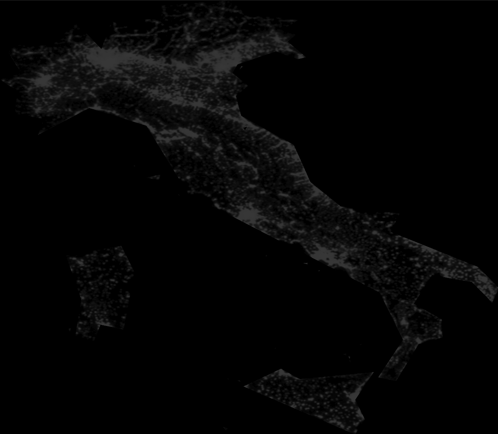
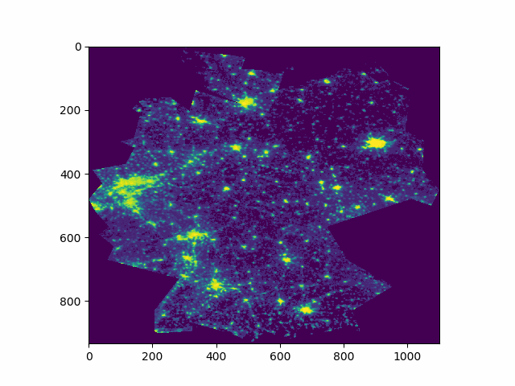

# About this repository
This repository shows how to predict GDP data with satellite images of the night sky. The main file for containing the code is called `GDP_satellite_estimation.ipynb`.

The main goal during creating this repository was learning *how to work* with satellite images and therefore there was little emphasis put on the statistical methods predicting GDP figures from the satellite data. This is a further point of improvement as mentioned below.

## 1. Relevant papers considered during research for the repository:
* Henderson, Storeygard & Weil (2019). Measuring Economic Growth from Outer Space  [click here](https://cepr.org/sites/default/files/meets/2409/papers/hendersonpaper.pdf)
* Martinez (2018). How Much Should We Trust the Dictator'€™s GDP
Estimates? [click here](https://ostromworkshop.indiana.edu/pdf/piep2018/martinez-paper.pdf)
* Zhao, Liu, Cao & Samson (2017) Forecasting China'€™s GDP at the pixel level using nighttime lights time series and population images [click here](https://www.tandfonline.com/eprint/dr3JMcWMQbImgR2MpDMY/full)
* Doll (2008) CIESIN Thematic Guide to Night-time Light
Remote Sensing and its Applications [click here](https://pdfs.semanticscholar.org/ff03/200355ce4f6f48a3c03fabc479e7fc46fa0f.pdf)

## 2. Getting started
Getting started is quite easy. If you download the entire repository you can now either start immediately by using the prepared data or download the missing data of the satellite images and run the entire calculation process on your own. 

### 2.1 Using the prepared data
For the first option you have to set:
`prepared_data = True` in the first code cell of the notebook. If you do so, then you will be able to run the entire notebook, but won't have the flexibility in changing the country data in each plot. 

### 2.2 Using the original data
If you want to be able to use the entire data and run the entire notebook yourself, then you will have to download the data first. To do so go to the [official website of the NOAA](https://ngdc.noaa.gov/eog/dmsp/downloadV4composites.html) and download the bundle called "Download Average Visible, Stable Lights, and Cloud Free Coverages". There you will need to unpack each of the individual years and in the respective sub-folders you need to unzip the files with the following format: `F101993.v4b_web.stable_lights.avg_vis`. It is important that you make sure that the words `stable_lights.avg_vis`
are included, as this as these are the files with the cleaned images (for more information on this see the NOAA's website or the data section of [this paper](https://pdfs.semanticscholar.org/ff03/200355ce4f6f48a3c03fabc479e7fc46fa0f.pdf)

Once unpacked you can set `prepared_data = False` and run the entire notebook using the real data. Please note that when you run the notebook the first time it will take a while as it the script will compute the light values from each satellite's image and year.

## 3. Output generated 
The notebook generates two kinds of outputs: pickle files and image cuts of the individual countries.

### 3.1 pickle files
When extracting data from the image files the script will save the resulting dataframe to a pickle file, as the computations can take a while and it may save the user time to just re-load the data from the pickle later on. The main file of importance here is the `lightdict_ISO3.pickle` file that is saved in the `./data` folder

### 3.2 Image cuts
The script saves images of the individual countries night sky so that these can be examined or re-used at a later point. These files are saved as .tif files in the folder `.output/images` and look like this image of Italy in 2013:

The images can be assembled together via a function in the script to create animations of the developments over time that look like this animation of the German sky from 1992-2013:

## 4. Data used in this notebook: 
The satellite data was collected and cleaned by the NOAA in the course of the Defense Meteorological Satellite Program (DMSP) using the Operational Linescan System (OLS).The files are cloud-free using all the available data for calendar years from 1992-2013. The products are 30 arc second grids, spanning -180 to 180 degrees longitude and -65 to 75 degrees latitude. The OLS is an camera with a broad field of view (the satellite flies at approx. 800km altitude) that can capture images at a resolution of 0.56km, which are then smoothed into 5x5 pixel blocks to 2.8km. 

The data used was collected between 8.30-10.00 pm for each location has been cleaned for: Cloud covered areas, special lightings (full-moon reflections, aurora lights), forest fires, glares caused by the solar elevation angle and more.

More information on the satellite images can be found in Doll (2008) referenced below.

* Satellite images: https://ngdc.noaa.gov/eog/dmsp/downloadV4composites.html
* GDP data: https://data.worldbank.org/indicator/NY.GDP.MKTP.CD
* Urbanization data: https://data.worldbank.org/indicator/sp.urb.totl.in.zs

## 5. Further features that could be added
You can always go further and add more features, meaning that in you also have to stop somewhere. For the case that somebody else might find this work interesting and might be interested in continuing the work on it I will note some ideas that I had during coding, but did not have enough time to pursue further:

* **Smooth satellite images being saved:** The function saving the images of the individual countries only saves *one image* per year of only *one satellite* (all numeric values are extracted though for the later use of the data). To make the animations smoother it might make sense to create the average of light intensity for the satellites overlapping in the respective years.
* **Add p-value and r-squared values to plots:** There are several plots including a regression line. For these it would be nice to add a small box in the plot (or a small text beneath the title) that indicates what the significance and the explanatory power of the regression is
* **Explore alternative prediction methods than OLS:** In my opinion the prediction results are much weaker than they could be - especially when considering the results of the papers mentioned. As my focus was on the general use of the satellite data and *not the process* of predicting GDP I have not explored this further. Some ideas to start with might be (A) using a log scalem (B) using change rates, and (C) adding polynomial features and interaction terms to the regression.

